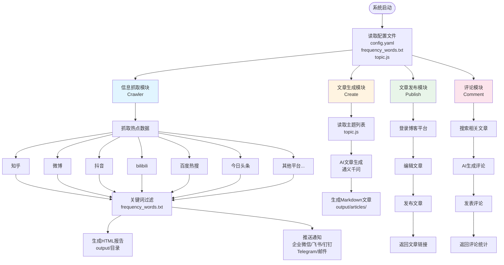
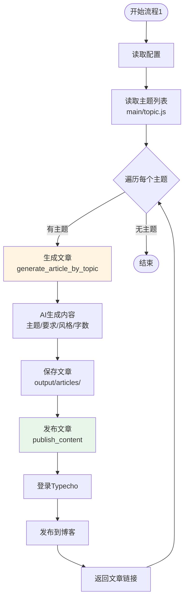
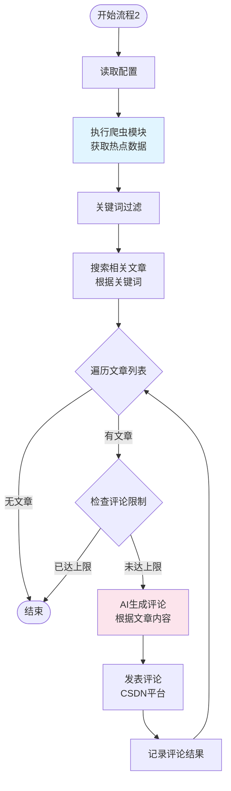
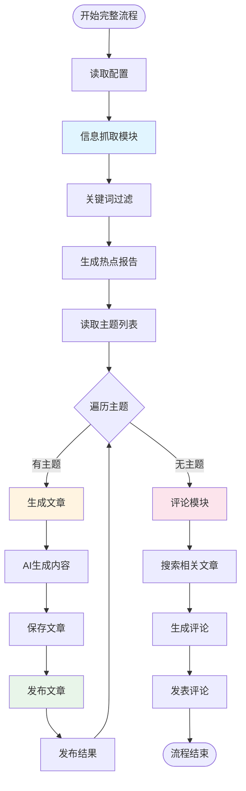
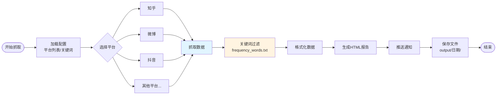
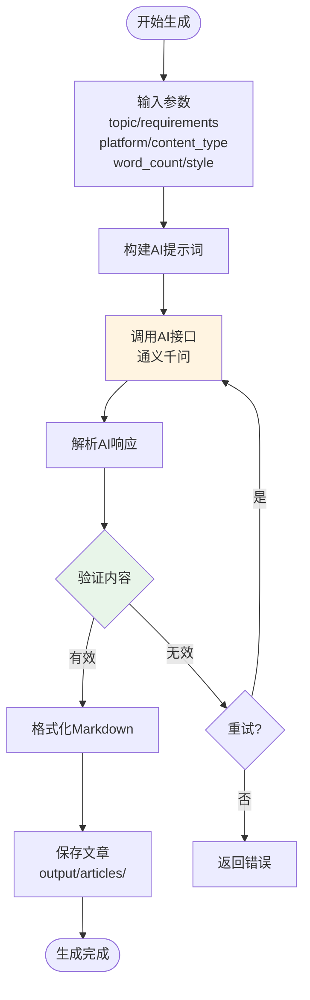
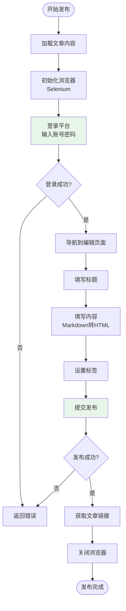
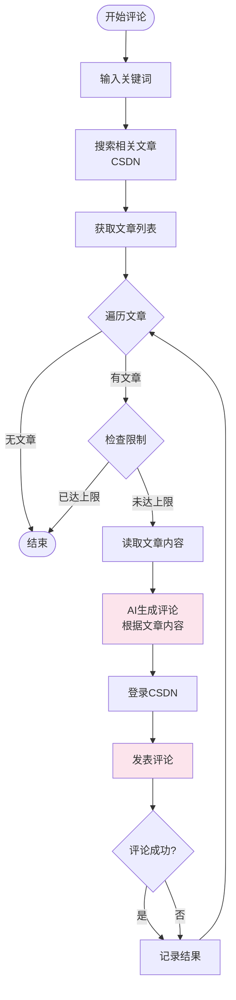
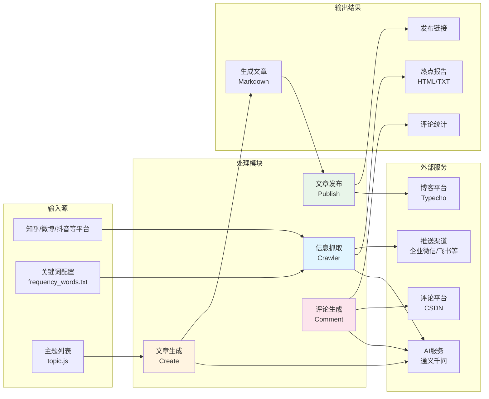

# TrendRadar 主要功能流程图

## 系统整体架构流程图

```mermaid
graph TB
    Start([系统启动]) --> Config[读取配置文件<br/>config.yaml<br/>frequency_words.txt<br/>topic.js]
    
    Config --> Crawler[信息抓取模块<br/>Crawler]
    Config --> Create[文章生成模块<br/>Create]
    Config --> Publish[文章发布模块<br/>Publish]
    Config --> Comment[评论模块<br/>Comment]
    
    Crawler --> CrawlerProcess[抓取热点数据]
    CrawlerProcess --> Platform1[知乎]
    CrawlerProcess --> Platform2[微博]
    CrawlerProcess --> Platform3[抖音]
    CrawlerProcess --> Platform4[bilibili]
    CrawlerProcess --> Platform5[百度热搜]
    CrawlerProcess --> Platform6[今日头条]
    CrawlerProcess --> Platform7[其他平台...]
    
    Platform1 --> Filter[关键词过滤<br/>frequency_words.txt]
    Platform2 --> Filter
    Platform3 --> Filter
    Platform4 --> Filter
    Platform5 --> Filter
    Platform6 --> Filter
    Platform7 --> Filter
    
    Filter --> Output1[生成HTML报告<br/>output/目录]
    Filter --> Push[推送通知<br/>企业微信/飞书/钉钉<br/>Telegram/邮件]
    
    Create --> ReadTopic[读取主题列表<br/>topic.js]
    ReadTopic --> AI[AI文章生成<br/>通义千问]
    AI --> Article[生成Markdown文章<br/>output/articles/]
    
    Publish --> Login[登录博客平台]
    Login --> Edit[编辑文章]
    Edit --> Post[发布文章]
    Post --> Result1[返回文章链接]
    
    Comment --> Search[搜索相关文章]
    Search --> GenerateComment[AI生成评论]
    GenerateComment --> PostComment[发表评论]
    PostComment --> Result2[返回评论统计]
    
    style Crawler fill:#e1f5ff
    style Create fill:#fff4e1
    style Publish fill:#e8f5e9
    style Comment fill:#fce4ec
```

## 工作流程1：爬取 → 生成 → 发布

```mermaid
flowchart TD
    Start1([开始流程1]) --> ReadConfig1[读取配置]
    ReadConfig1 --> ReadTopic1[读取主题列表<br/>main/topic.js]
    
    ReadTopic1 --> Loop1{遍历每个主题}
    Loop1 -->|有主题| Generate1[生成文章<br/>generate_article_by_topic]
    Loop1 -->|无主题| End1([结束])
    
    Generate1 --> AI1[AI生成内容<br/>主题/要求/风格/字数]
    AI1 --> Save1[保存文章<br/>output/articles/]
    
    Save1 --> Publish1[发布文章<br/>publish_content]
    Publish1 --> Login1[登录Typecho]
    Login1 --> Post1[发布到博客]
    Post1 --> Result1[返回文章链接]
    
    Result1 --> Loop1
    
    style Generate1 fill:#fff4e1
    style Publish1 fill:#e8f5e9
```

## 工作流程2：爬取 → 评论

```mermaid
flowchart TD
    Start2([开始流程2]) --> ReadConfig2[读取配置]
    ReadConfig2 --> Crawler2[执行爬虫模块<br/>获取热点数据]
    
    Crawler2 --> Filter2[关键词过滤]
    Filter2 --> Search2[搜索相关文章<br/>根据关键词]
    
    Search2 --> Loop2{遍历文章列表}
    Loop2 -->|有文章| CheckLimit{检查评论限制}
    Loop2 -->|无文章| End2([结束])
    
    CheckLimit -->|未达上限| GenerateComment2[AI生成评论<br/>根据文章内容]
    CheckLimit -->|已达上限| End2
    
    GenerateComment2 --> PostComment2[发表评论<br/>CSDN平台]
    PostComment2 --> Result2[记录评论结果]
    
    Result2 --> Loop2
    
    style Crawler2 fill:#e1f5ff
    style GenerateComment2 fill:#fce4ec
```

## 工作流程3：完整自动化流程

```mermaid
flowchart TD
    Start3([开始完整流程]) --> ReadConfig3[读取配置]
    ReadConfig3 --> Crawler3[信息抓取模块]
    
    Crawler3 --> Filter3[关键词过滤]
    Filter3 --> Output3[生成热点报告]
    
    Output3 --> ReadTopic3[读取主题列表]
    ReadTopic3 --> Loop3{遍历主题}
    
    Loop3 -->|有主题| Generate3[生成文章]
    Loop3 -->|无主题| Comment3[评论模块]
    
    Generate3 --> AI3[AI生成内容]
    AI3 --> Save3[保存文章]
    Save3 --> Publish3[发布文章]
    Publish3 --> Result3[发布结果]
    
    Result3 --> Loop3
    
    Comment3 --> Search3[搜索相关文章]
    Search3 --> GenerateComment3[生成评论]
    GenerateComment3 --> PostComment3[发表评论]
    PostComment3 --> End3([流程结束])
    
    style Crawler3 fill:#e1f5ff
    style Generate3 fill:#fff4e1
    style Publish3 fill:#e8f5e9
    style Comment3 fill:#fce4ec
```

## 模块详细流程图

### 信息抓取模块详细流程

```mermaid
flowchart LR
    StartC([开始抓取]) --> LoadConfig[加载配置<br/>平台列表/关键词]
    LoadConfig --> SelectPlatform{选择平台}
    
    SelectPlatform --> P1[知乎]
    SelectPlatform --> P2[微博]
    SelectPlatform --> P3[抖音]
    SelectPlatform --> P4[其他平台...]
    
    P1 --> Fetch[抓取数据]
    P2 --> Fetch
    P3 --> Fetch
    P4 --> Fetch
    
    Fetch --> FilterC[关键词过滤<br/>frequency_words.txt]
    FilterC --> Format[格式化数据]
    Format --> GenerateHTML[生成HTML报告]
    GenerateHTML --> PushNotify[推送通知]
    PushNotify --> SaveFile[保存文件<br/>output/日期/]
    SaveFile --> EndC([结束])
    
    style Fetch fill:#e1f5ff
    style FilterC fill:#fff4e1
```

### 文章生成模块详细流程

```mermaid
flowchart TD
    StartG([开始生成]) --> Input[输入参数<br/>topic/requirements<br/>platform/content_type<br/>word_count/style]
    
    Input --> BuildPrompt[构建AI提示词]
    BuildPrompt --> CallAI[调用AI接口<br/>通义千问]
    
    CallAI --> Parse[解析AI响应]
    Parse --> Validate{验证内容}
    
    Validate -->|有效| FormatG[格式化Markdown]
    Validate -->|无效| Retry{重试?}
    
    Retry -->|是| CallAI
    Retry -->|否| Error[返回错误]
    
    FormatG --> SaveG[保存文章<br/>output/articles/]
    SaveG --> EndG([生成完成])
    
    style CallAI fill:#fff4e1
    style Validate fill:#e8f5e9
```

### 文章发布模块详细流程

```mermaid
flowchart TD
    StartP([开始发布]) --> LoadArticle[加载文章内容]
    LoadArticle --> InitBrowser[初始化浏览器<br/>Selenium]
    
    InitBrowser --> LoginP[登录平台<br/>输入账号密码]
    LoginP --> CheckLogin{登录成功?}
    
    CheckLogin -->|否| ErrorP[返回错误]
    CheckLogin -->|是| Navigate[导航到编辑页面]
    
    Navigate --> FillTitle[填写标题]
    FillTitle --> FillContent[填写内容<br/>Markdown转HTML]
    FillContent --> SetTags[设置标签]
    SetTags --> Submit[提交发布]
    
    Submit --> CheckPublish{发布成功?}
    CheckPublish -->|是| GetLink[获取文章链接]
    CheckPublish -->|否| ErrorP
    
    GetLink --> CloseBrowser[关闭浏览器]
    CloseBrowser --> EndP([发布完成])
    
    style LoginP fill:#e8f5e9
    style Submit fill:#e8f5e9
```

### 评论模块详细流程

```mermaid
flowchart TD
    StartCom([开始评论]) --> InputKeyword[输入关键词]
    InputKeyword --> SearchCom[搜索相关文章<br/>CSDN]
    
    SearchCom --> GetArticles[获取文章列表]
    GetArticles --> LoopCom{遍历文章}
    
    LoopCom -->|有文章| CheckLimitCom{检查限制}
    LoopCom -->|无文章| EndCom([结束])
    
    CheckLimitCom -->|未达上限| ReadArticle[读取文章内容]
    CheckLimitCom -->|已达上限| EndCom
    
    ReadArticle --> GenerateCom[AI生成评论<br/>根据文章内容]
    GenerateCom --> LoginCom[登录CSDN]
    LoginCom --> PostCom[发表评论]
    
    PostCom --> CheckCom{评论成功?}
    CheckCom -->|是| Record[记录结果]
    CheckCom -->|否| Record
    
    Record --> LoopCom
    
    style GenerateCom fill:#fce4ec
    style PostCom fill:#fce4ec
```

## 数据流向图

```mermaid
graph LR
    subgraph 输入源
        A1[知乎/微博/抖音等平台]
        A2[关键词配置<br/>frequency_words.txt]
        A3[主题列表<br/>topic.js]
    end
    
    subgraph 处理模块
        B1[信息抓取<br/>Crawler]
        B2[文章生成<br/>Create]
        B3[文章发布<br/>Publish]
        B4[评论生成<br/>Comment]
    end
    
    subgraph 输出结果
        C1[热点报告<br/>HTML/TXT]
        C2[生成文章<br/>Markdown]
        C3[发布链接]
        C4[评论统计]
    end
    
    subgraph 外部服务
        D1[AI服务<br/>通义千问]
        D2[博客平台<br/>Typecho]
        D3[评论平台<br/>CSDN]
        D4[推送渠道<br/>企业微信/飞书等]
    end
    
    A1 --> B1
    A2 --> B1
    A3 --> B2
    
    B1 --> D1
    B1 --> C1
    B1 --> D4
    
    B2 --> D1
    B2 --> C2
    C2 --> B3
    
    B3 --> D2
    B3 --> C3
    
    B4 --> D1
    B4 --> D3
    B4 --> C4
    
    style B1 fill:#e1f5ff
    style B2 fill:#fff4e1
    style B3 fill:#e8f5e9
    style B4 fill:#fce4ec
```

